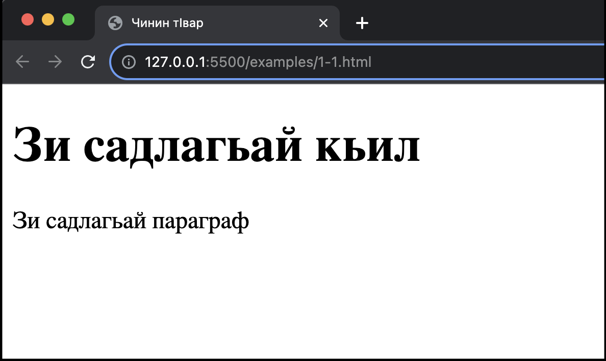

# HTML. Чирхчир хьун.

`HTML` - веб-чинар туькӀуьрунин стандарт я.

## HTML вуч я?

- HTML - гьипертекст яржунин чIал я (ингл. HyperText Markup Language);
- HTML-ди веб-чинин структура туькӀуьрзава.
- HTML вич HTML-элементрикай туькӀуьр жезва.
- HTML-элементри браузердиз веб-чина авай инфо гьикӀ къалурдатӀа лугьузва.
- HTML-элементри веб-чинин кӀусарик манаяр кутазва. Месела, "им веб-чинин кӀукӀ я", "им шикил я", гьакӀни мад.

## ГьакӀан HTML-документ

```html title="Месела"
<!DOCTYPE html>
<html>
<head>
<title>Чинин тIвар</title>
</head>
<body>

<h1>Зи садлагьай кьил</h1>
<p>Зи садлагьай параграф</p>

</body>
</html>
```
### Гъавурда тун

- Чна `<!DOCTYPE html>` кхьизватӀа, ам чна HTML5-документ туькӀуьрзава лагьай чӀал я. `HTML5` - HTML-дин вадлагьай версия я.
- `html` элемент - чи HTML-чинин дувул я. `<html>` - им HTML-чинин и-кьил я. `</html>` - им HTML-чинин а-кьил я.
- `head` элемент - им чна чи мета-гайияр хуьзвай чка я. А гайияр браузерриз, жугъурунин системайриз герек я. `<head>` - им head элементдин и-кьил я. `</head>` - им `head` элементдин а-кьил я.
- `title` элементди чи HTML-чиниз тӀвар гузва. Ам чаз браузерди чинин тӀвар къалурзавай чкада аквазва. Адет яз, а чка браузердин дакӀардин вине ава.
- `body` элемент чи документдин беден я. Адан къене чи вилиз аквадай затӀар ава (текстар, шикилар, гьакӀни мад).
- `h1` элемент - им садлагьай (виридлайни чӀехи тир) дережадин кьил я. Ада вири чиниз талукь тир тӀвар гузва. Мад гьихьтин кьилер аватIа чна мукьвара чирда.
- `p` элемент - им текстдин параграф я.

## HTML-элемент вуч я?
HTML-элементдин туькӀуьр хьунухь:
1. ахъаюнин тег;
2. къенепад;
3. кӀевунин тег;

```html
<тегдинТIвар> Им къенепад я... </тегдинТIвар>
```

Ахъаюнин тегдалай кIевунин тегдалди - им вири **HTML-элемент** я:

```html
<h1>Зи садлагьай кьил</h1>
<p>Зи садлагьай параграф</p>
```

| Ахъаюнин тег | Къенепад             | КӀевунин тег |
|--------------|----------------------|--------------|
| `<h1>`       | Зи садлагьай кьил    | `</h1>`      |
| `<p>`        | Зи садлагьай параграф| `</p>`       |
| `<br>`       | *авач*               | *авач*       |


:::tip Note

Са-са HTML-элементриз къенепад авач. Ахьтин элементриз **ичӀи элементар** лугьуда. ИчӀи элементриз кӀевунин тег авач.

:::


## Веб-браузерар
Веб-браузердин (месела, Chrome, Edge, Firefox, Safari) метлеб - HTML-документ кӀелун, ахпа чаз къенидаказ къалурун.
Браузерди HTML-тегар къалурзавачтIани, ада абур кӀелдайла, адаз инфо гьикӀ къалурдатӀа чир жезва.



## HTML-чинин структура

<div style={{ backgroundColor: '#E7E9EB', color: 'black', width: '99%', border: '1px solid grey', padding: '3px', margin: '0' }}>
  &lt;html&gt;
  <div style={{ width: '90%', border: '1px solid grey', padding: '3px', margin: '20px' }}>
    &lt;head&gt;
    <div style={{ width: '90%', border: '1px solid grey', padding: '5px', margin: '20px' }}>
      &lt;title&gt;Чинин тIвар&lt;/title&gt;
    </div>
    &lt;/head&gt;
  </div>
  <div style={{ backgroundColor: '#E7E9EB', color: 'black', width: '90%', border: '1px solid grey', padding: '3px', margin: '20px' }}>
    &lt;body&gt;
    <div style={{ backgroundColor: '#fff', color: 'black', width: '90%', border: '1px solid grey', padding: '3px', margin: '20px' }}>
      <div style={{ width: '90%', border: '1px solid grey', padding: '5px', margin: '20px' }}>
        &lt;h1&gt;Им кьил я&lt;/h1&gt;
      </div>
      <div style={{ width: '90%', border: '1px solid grey', padding: '5px', margin: '20px' }}>
        &lt;p&gt;Им параграф я&lt;/p&gt;
      </div>
      <div style={{ width: '90%', border: '1px solid grey', padding: '5px', margin: '20px' }}>
        &lt;p&gt;Им мад са параграф я&lt;/p&gt;
      </div>
    </div>
    &lt;/body&gt;
  </div>
  &lt;/html&gt;
</div>
<br />

:::tip Note

HTML-чинин структура икӀ чӀугайтӀа жеда. `<body>` элементдин къенепад чаз браузерда аквазва. `<title>` элементдин къенепад чаз браузерди чинин тӀвар къалурзавай чкада аквазва.

:::


<i style={{float: 'right'}}>Чешме <a href="https://www.w3schools.com/html/html_intro.asp" target="_blank">Introduction to HTML</a></i>